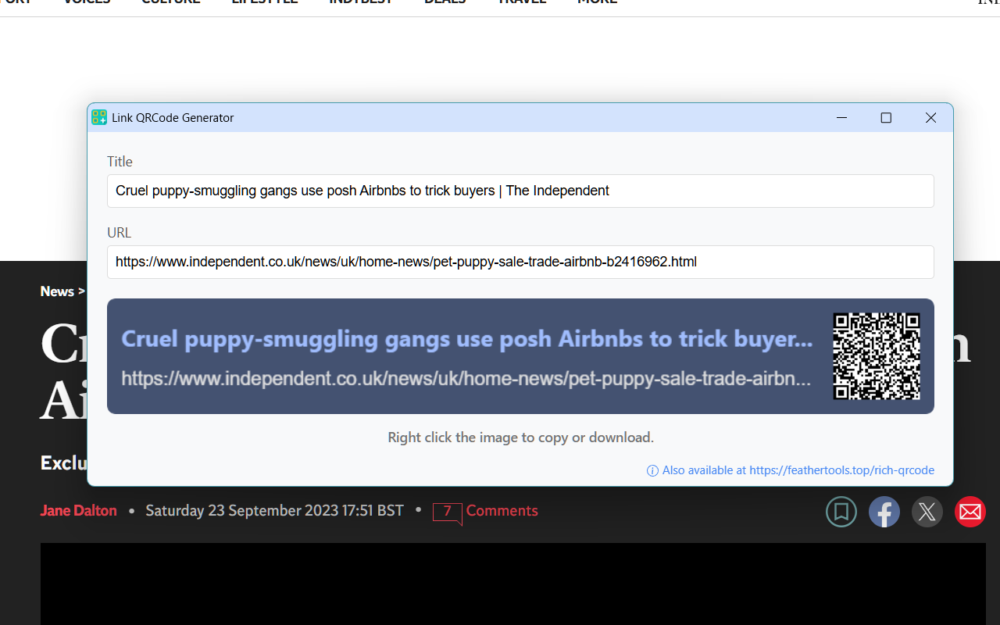

# Link QRCode Generator

A Chrome extension that generates QR codes for links, making it easy to share web content between devices.

## Features

- Generate QR codes for current tab URL
- Customizable QR code with title
- Copy QR code to clipboard
- Save QR code as image
- Internationalization support (English and Chinese)

## Usage

1. Click on the extension icon in the Chrome toolbar
2. The current tab URL and title will be automatically filled in
3. Optionally, modify the title or URL as needed - the QR code will update automatically
4. Right-click on the QR code to copy or save it

## Installation in Development Mode

1. Clone or download this repository
2. Open Chrome and navigate to `chrome://extensions/`
3. Enable "Developer mode" in the top right corner
4. Click "Load unpacked" and select the `app` directory from this repository
5. The extension will be installed and ready to use

## License

This project is licensed under the MIT License - see the [LICENSE](LICENSE) file for details